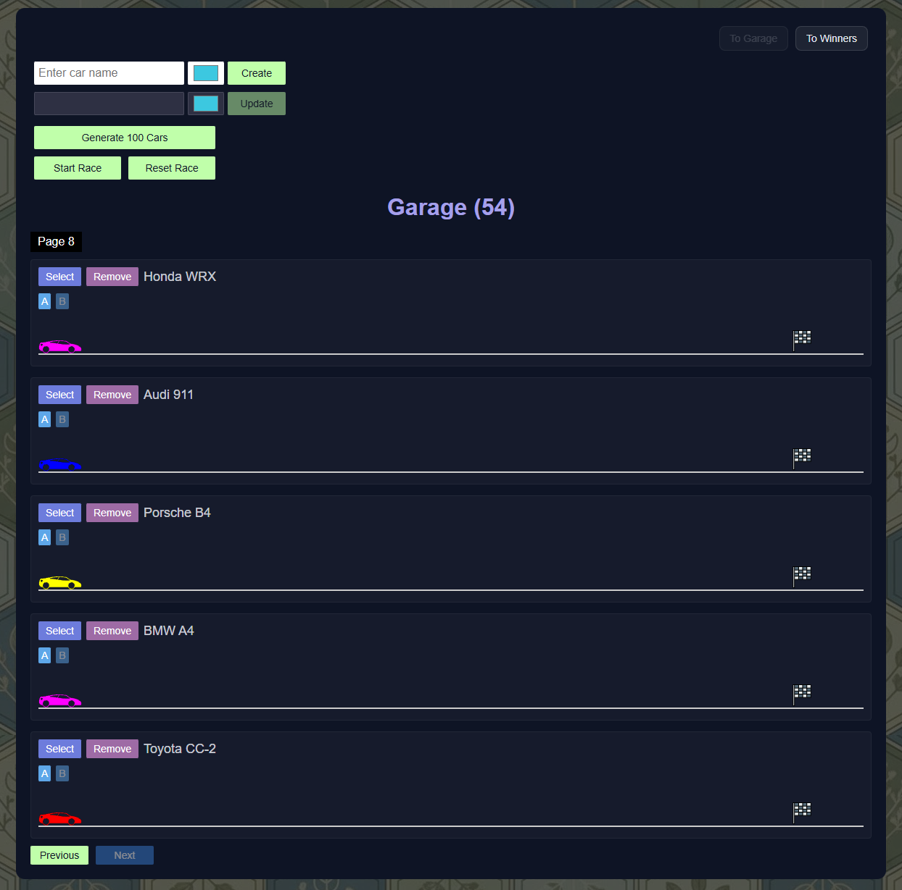
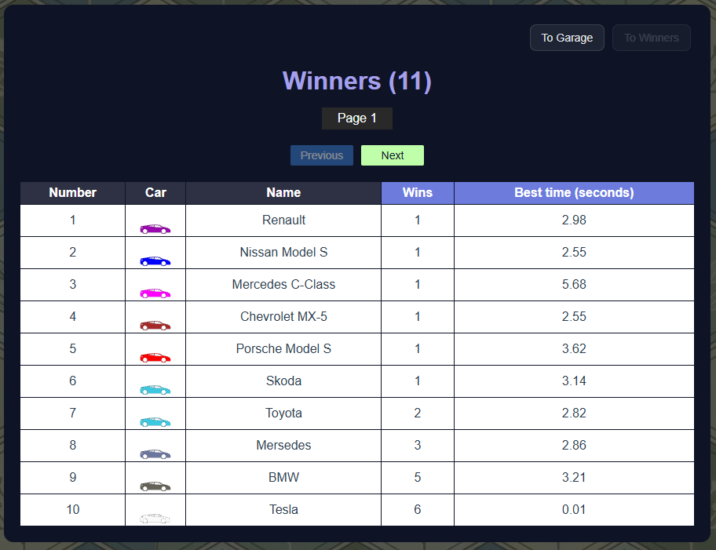

# Async Race

**Async Race** — a web application for managing car races with real-time animations and winner tracking. Create, customize, and race cars with an intuitive interface and smooth animations.

## 🌐 Live Demo
[Netlify](https://q-async-race.netlify.app/)

Note that the application requires the backend API server to be running (see API setup instructions below).

## 🖥️ Screenshots

<div align="center">
  
  
</div>

## Features

1. **Garage Management**
   - Create, update, and delete cars with custom names and colors
   - Generate 100 random cars with one click
   - Pagination for large car collections (7 cars per page)
   - Real-time car list updates

2. **Racing System**
   - Start individual car races with animated movement
   - Start mass races with all cars competing simultaneously
   - Reset race functionality to return all cars to start
   - Engine failure simulation with visual feedback
   - Smooth CSS animations with calculated duration based on velocity

3. **Winner Tracking**
   - Automatic winner detection and saving
   - Winners table with pagination (10 winners per page)
   - Sortable columns (wins, best time)
   - Sort order toggle (ASC/DESC)
   - Winner name and time display

4. **User Interface**
   - Clean, modern dark-themed design
   - Responsive layout
   - Button state management during races
   - Winner announcement popup
   - Navigation between Garage and Winners pages
   - Persistent page state via URL routing

5. **Technical Features**
   - TypeScript for type safety
   - Modular code architecture
   - Async/await for race management
   - Promise-based race coordination
   - Error handling and validation

## Tech Stack

* **TypeScript**
* **Vite**
* **REST API** (async-race-api)

## Prerequisites

Before running this application, you need to set up and run the backend API server. Below you'll find the complete installation instructions.

### Backend API Setup

This application requires the [async-race-api](https://github.com/mikhama/async-race-api) to be running locally.

1. **Clone the API repository:**
   ```bash
   git clone https://github.com/mikhama/async-race-api.git
   ```

2. **Navigate to the API directory:**
   ```bash
   cd async-race-api
   ```

3. **Install dependencies:**
   ```bash
   npm install
   ```

4. **Start the API server:**
   ```bash
   npm start
   ```

   The API will be available at `http://127.0.0.1:3000`

## Run Locally

1. **Clone the repository:**
   ```bash
   git clone https://github.com/SquallerQ/async-race.git
   cd async-race
   ```

2. **Install dependencies:**
   ```bash
   npm install
   ```

3. **Make sure the API server is running** (see Prerequisites above)

4. **Start the development server:**
   ```bash
   npm run dev
   ```

5. **Open the app in your browser** (usually at `http://localhost:5173`)

## API Endpoints

The application uses the following API endpoints (provided by async-race-api):

- `GET /garage` - Get cars list
- `POST /garage` - Create car
- `PUT /garage/:id` - Update car
- `DELETE /garage/:id` - Delete car
- `PATCH /engine?id=:id&status=started` - Start engine
- `PATCH /engine?id=:id&status=stopped` - Stop engine
- `PATCH /engine?id=:id&status=drive` - Drive mode
- `GET /winners` - Get winners list
- `POST /winners` - Create winner
- `PUT /winners/:id` - Update winner
- `DELETE /winners/:id` - Delete winner
